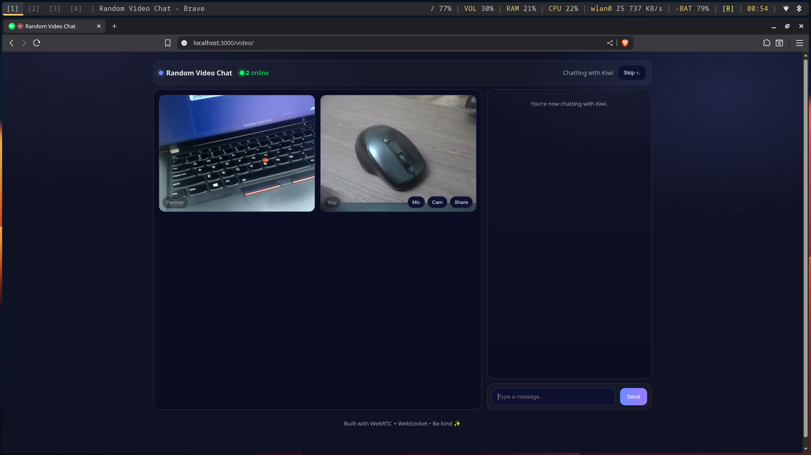
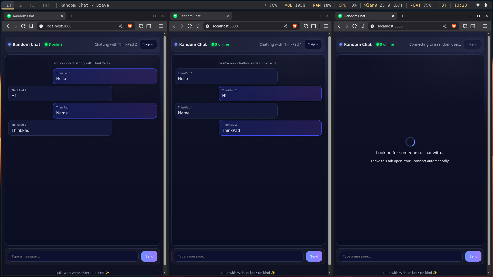

<div align="center">
    <h1>ws-chat-app</h1>
    
    <p>Simple text and video chat app like Omegle using <a
            href="https://nodejs.org/en/learn/getting-started/websocket">WebSockets</a> and 
            <a href="https://webrtc.org/">WebRTC</a>.</p>

<p align="center">
  <a href="https://nodejs.org" target="_blank">
    
  </a>
  <a href="https://expressjs.com" target="_blank">
    
  </a>
  <a href="https://developer.mozilla.org/en-US/docs/Web/API/WebSockets_API" target="_blank">
    
  </a>
  <a href="https://github.com" target="_blank">
    
  </a>
  <a href="https://webrtc.org/" target="_blank">
    
  </a>
</p>

</div>

## Screenshots
<div align="center">
    
    <p>Video Chat</p>
    
    <p>Text Chat/p>
</div>

## Features
- No database required.
- Simple interface.
- Auto pairing with strangers.
- Skip button.
- Fast
- Store user's name in localSorage.

## Run your own

```bash
git clone https://github.com/shamilsaleem/ws-chat-app.git
cd ws-chat-app
npm install
npm start
```

Made with ❤️ by [shamilsaleem](https://www.instagram.com/shamil.saleem)
